# Architecture

This document describes how a single user turn flows through RAVANA, and how the
three first-party packages relate. All paths are relative to the repo root.

## The three packages

RAVANA is one integrated system split across three source trees under `*/src`:

| Package | Path | Role |
|---------|------|------|
| `ravana_ml` | `ravana_ml/src/ravana_ml/` | CPU-native ML substrate: tensors, `ConceptGraph`, `RLM`/`RLMv2`, neural decoder, embedders, ontologies. |
| `ravana` | `ravana/src/ravana/` | Decoder-first chat engine: the live `CognitiveChatEngine`, brain-repair preprocessing, language generation, web learning. |
| `ravana_grace` | `ravana-v2/src/ravana_grace/` | GRACE 20-phase cognitive governor (A–P): identity, emotion, sleep, meaning, world model, theory-of-mind, metacognition, etc. |

They are imported together by the chat entrypoint
(`scripts/ravana_chat.py` inserts all three `src` dirs on `sys.path`). There is
no separate runtime dependency between them at the OS level — they are one repo.

## Package relationship diagram

```mermaid
%%{init: {'theme': 'base', 'themeVariables': { 'primaryColor': '#f0f4ff', 'primaryTextColor': '#1a1a2e', 'primaryBorderColor': '#4a6fa5', 'lineColor': '#4a6fa5', 'secondaryColor': '#fefefe', 'tertiaryColor': '#e8f4f8'}}}%%
flowchart TB
    subgraph User["User"]
        UI[("User Input")]
    end

    subgraph ML["ravana_ml — ML Substrate"]
        TG["tensor.py<br/>Raw/State tensors"]
        NN["nn/<br/>Module, Linear, GRU<br/>NeuralDecoder, RLMv2"]
        GR["graph.py<br/>ConceptGraph<br/>ConceptNode, ConceptEdge"]
        FE["free_energy.py<br/>FreeEnergyAccumulator"]
        PL["plasticity.py<br/>Hebbian/Anti-Hebbian"]
        EM["embedder.py<br/>GloVe→64D Projection"]
        OT["mapper.py<br/>AttributeEncoder<br/>LancasterEncoder"]
    end

    subgraph CHAT["ravana — Chat Engine"]
        BR["chat/brain_regions.py<br/>SelfModel, EpisodicIndex<br/>CauseClassifier, Empathy"]
        EN["chat/engine.py<br/>CognitiveChatEngine<br/>process_turn(), save(), load()"]
        CW["chat/chain_walker.py<br/>ChainWalkerMixin<br/>_seed_concepts, _spread_and_collect"]
        RG["chat/response_gen.py<br/>ResponseGenMixin<br/>Neural decoder, templates"]
        WL["chat/web_learning.py<br/>WebLearningMixin<br/>Web search → graph edges"]
        CG["chat/coherence_gate.py<br/>CoherenceGate<br/>Junk/Salad detection"]
        IR["chat/intent_router.py<br/>IntentRouter<br/>6-class routing"]
        SR["chat/self_model_router.py<br/>SelfAddressRouter"]
        LG["language/<br/>SurfaceRealizer, VerbLexicon<br/>SyntacticAssembly, PFC"]

        WEB["web/<br/>SearchEngine, WebLearner<br/>OpenIE, WebToGraph"]
        DEC["decoder/<br/>DecoderEngine<br/>PredictiveCodingGenerator"]
        GRA["graph/<br/>GraphEngine"]

        COR["core/<br/>VADEmotion, Identity, Meaning<br/>WorkingMemory, PredictiveCoding<br/>VSAManager, HRRReasoner<br/>System1/System2"]
        BOOT["bootstrap/<br/>BootstrapManager, PMISeeder"]
        LEARN["learn/<br/>CuriosityEngine, HippocampalReplay"]
        ONT["ontology/<br/>DerivedOntology, ConceptNet<br/>LingGenConditioner"]
        NN2["nn/rlm/<br/>RelationPredictor, Propagation, Plasticity"]
    end

    subgraph GRACE["ravana_grace — GRACE Governor"]
        GV["core/governor.py<br/>Governor, GovernorConfig<br/>RegulationMode"]
        EM2["core/emotion.py<br/>VADEmotionEngine<br/>Valence/Arousal/Dominance"]
        ID["core/identity.py<br/>IdentityEngine<br/>Self-concept stabilization"]
        SL["core/sleep.py<br/>SleepConsolidation<br/>4-stage SWS+REM"]
        ME["core/meaning.py<br/>MeaningEngine<br/>Intrinsic motivation"]
        MC["core/meta_cognition.py<br/>MetaCognition, BiasDetector<br/>ConfidenceCalibrator"]
        BE["core/belief_reasoner.py<br/>BeliefReasoner<br/>Multi-hypothesis reasoning"]
        DP["core/dual_process.py<br/>DualProcessController<br/>System 1/2 routing"]
        GW["core/global_workspace.py<br/>GlobalWorkspace<br/>Conscious broadcast"]
        HM["core/human_memory.py<br/>HumanMemoryEngine<br/>Episodic/Semantic"]

        ACT["core/active_epistemology.py<br/>ActiveEpistemology<br/>VoI-driven action"]
        WO["core/predictive_world.py<br/>LearnedWorldModel<br/>FalseWorldTester"]
        ST["core/strategy.py<br/>StrategyLayer<br/>Exploration modes"]
        OC["core/occam_layer.py<br/>OccamLayer<br/>Hypothesis discipline"]
    end

    UI --> BR
    BR --> EN
    EN --> CG
    CG --> IR
    IR --> SR
    SR --> CW
    CW --> GR
    CW --> RG
    RG --> DEC
    DEC --> NN
    RG --> LG
    LG --> ME
    LG --> EM2
    WL --> WEB
    WL --> GR
    COR --> EN
    EN --> GW
    EN --> DP
    EN --> MC
    EN --> SL
    EN --> EM2
    EN --> ID
    EN --> BE
    LEARN --> EN
    ONT --> EN
    BOOT --> CW

    GR -.-> NN
    GR -.-> FE
    GR -.-> PL

    GV -.-> EM2
    GV -.-> ID
    GV -.-> SL
    GV -.-> ME
    GV -.-> WO
    GV -.-> ACT

    style UI fill:#e1f5fe,stroke:#0288d1
    style EN fill:#fff3e0,stroke:#f57c00,stroke-width:2px
    style GR fill:#e8f5e9,stroke:#388e3c
    style NN fill:#e8f5e9,stroke:#388e3c
    style GV fill:#fce4ec,stroke:#c62828
    style EM2 fill:#fce4ec,stroke:#c62828
```



## Turn-level data flow

```
user text
   │
   ▼
[1] brain_regions.py  ── BRAIN-REPAIR PREPASSES ──
      • SelfModel.from_graph        (who am I / who is the user)
      • EpisodicIndex               (FIRST/LAST/BY_ENTITY recall)
      • classify_cause              (GloVe-centroid cause classification)
      • select_empathy_frame        (tightly-gated empathy)
      • humor_is_coherent           (learned salad classifier ORed with
                                     rule-based _is_word_salad; fail-closed)
      • parse_number_phrase / mirror_deictic / consult_internal
   │
   ▼
[2] engine.py :: CognitiveChatEngine.process_turn
      • intent_router          (chitchat / factual / hypothetical / identity / OOD)
      • monitor_gate           (abstention / free-energy check)
      • coherence_gate         (GloVe-cosine coherence floor)
      • junk_scorer            (word-salad / degenerate-text rejection)
   │
   ├─ if unknown / low-confidence ─► honest abstention ("I don't know")
   │
   ▼
[3] graph walk  (chain_walker.py)  over the typed ConceptGraph
      edges: causal, contrastive, analogical, temporal, semantic, is_a
   │
   ▼
[4] neural decoder  (ravana_ml.nn.neural_decoder)
      conditions generation on the graph-walk embedding + sensorimotor
      (LingGen) signal when promoted
   │
   ▼
[5] surface_realizer + syntactic cell assembly  →  natural-language response
   │
   ▼
[6] web_learning.py  (background)  ── if a gap was detected, learn from the web
      and write new typed edges into the graph for next time
```

## How the packages connect at runtime

The chat engine (`CognitiveChatEngine` in `ravana/`) is the orchestrator. It:

1. **Imports GRACE modules** from `ravana_grace.core` for emotion, identity, sleep,
   dual-process, global workspace, and metacognition
2. **Uses the ML substrate** from `ravana_ml` for the `ConceptGraph`, neural decoder,
   tensor operations, and free-energy accumulation
3. **Adds its own layers** — brain-repair prepasses, language generation (realizer,
   verb lexicon, syntactic assembly), web learning, intent routing

The GRACE governor (`Governor` in `ravana_grace.core.governor`) is NOT used by the
chat engine — instead, the chat engine uses individual GRACE modules independently.
The full Governor pipeline (20 phases, A–P) is designed for standalone research use.

## Concept graph

`ravana_ml.graph.ConceptGraph` stores nodes (concepts, 64-D vectors) and typed
edges with weights, confidence, and prediction free-energy. At init it snapshots
**stable nodes** so that same-turn web-learning cannot defeat the connectivity /
anchor gates (a previously-fixed pitfall — see `brain_regions.py` notes).

Seed concepts (~180 teen-level words) and their relations are defined in
`scripts/ravana_chat.py` (`DOMAIN_CONCEPTS`). ConceptNet + GloVe (projected to
64-D) supply semantic priors.

## Decoder

`ravana_ml.nn.neural_decoder.NeuralDecoder` is a small GRU conditioned on a
concept embedding. It is trained online (no offline corpus required) on
`data/corpora/teen_seeds.txt` plus whatever the web-learning loop harvests.
`sleep_cycle()` performs consolidation (the free-energy "instead of
`optimizer.step()`" loop).

## GRACE governor

`ravana_grace.core.Governor` wraps the chat/cognitive stack with 20 phases (A–P) of
regulation: identity, emotion (VAD), sleep, meaning, world model, belief
reasoning, active epistemology, metacognition, strategy selection, and more. It
is imported by `scripts/ravana_chat.py` and driven per turn.

## State & persistence

Runtime artifacts (`data/`, `checkpoints/`, `output/`) are gitignored. The
engine serializes weights to `data/ravana_weights.pkl` and a SQLite store
(`data/ravana_weights.db`). A fresh clone needs the corpus present (or run
`python scripts/gather_teen_seeds.py` to rebuild it).
